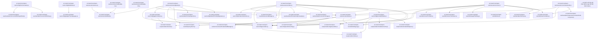

### Sơ đồ Dependencies Dự án (Codegraph)

```mermaid
graph TD;
    ai-router_core_open-sse_config_appConstants_js["ai-router/core/open-sse/config/appConstants.js"] --> ai-router_core_open-sse_config_providers_js["ai-router/core/open-sse/config/providers.js"];
    ai-router_core_open-sse_config_appConstants_js["ai-router/core/open-sse/config/appConstants.js"] --> ai-router_core_open-sse_providers_shared_js["ai-router/core/open-sse/providers/shared.js"];
    ai-router_core_open-sse_config_kiroConstants_js["ai-router/core/open-sse/config/kiroConstants.js"] --> ai-router_core_open-sse_translator_concerns_thinkingUnified_js["ai-router/core/open-sse/translator/concerns/thinkingUnified.js"];
    ai-router_core_open-sse_config_kiroConstants_js["ai-router/core/open-sse/config/kiroConstants.js"] --> ai-router_core_open-sse_translator_concerns_thinking_js["ai-router/core/open-sse/translator/concerns/thinking.js"];
    ai-router_core_open-sse_config_providerModels_js["ai-router/core/open-sse/config/providerModels.js"] --> ai-router_core_open-sse_config_providers_js["ai-router/core/open-sse/config/providers.js"];
    ai-router_core_open-sse_config_providerModels_js["ai-router/core/open-sse/config/providerModels.js"] --> ai-router_core_open-sse_providers_registry_index_js["ai-router/core/open-sse/providers/registry/index.js"];
    ai-router_core_open-sse_config_providerModels_js["ai-router/core/open-sse/config/providerModels.js"] --> ai-router_core_open-sse_providers_index_js["ai-router/core/open-sse/providers/index.js"];
    ai-router_core_open-sse_config_providerModels_js["ai-router/core/open-sse/config/providerModels.js"] --> ai-router_core_open-sse_providers_models_schema_js["ai-router/core/open-sse/providers/models/schema.js"];
    ai-router_core_open-sse_config_providerModels_js["ai-router/core/open-sse/config/providerModels.js"] --> ai-router_core_open-sse_providers_models_helpers_js["ai-router/core/open-sse/providers/models/helpers.js"];
    ai-router_core_open-sse_config_providers_js["ai-router/core/open-sse/config/providers.js"] --> ai-router_core_open-sse_providers_index_js["ai-router/core/open-sse/providers/index.js"];
    ai-router_core_open-sse_config_ttsModels_js["ai-router/core/open-sse/config/ttsModels.js"] --> ai-router_core_open-sse_config_googleTtsLanguages_js["ai-router/core/open-sse/config/googleTtsLanguages.js"];
    ai-router_core_open-sse_executors_antigravity_js["ai-router/core/open-sse/executors/antigravity.js"] --> ai-router_core_open-sse_executors_base_js["ai-router/core/open-sse/executors/base.js"];
    ai-router_core_open-sse_executors_antigravity_js["ai-router/core/open-sse/executors/antigravity.js"] --> ai-router_core_open-sse_config_providers_js["ai-router/core/open-sse/config/providers.js"];
    ai-router_core_open-sse_executors_antigravity_js["ai-router/core/open-sse/executors/antigravity.js"] --> ai-router_core_open-sse_config_appConstants_js["ai-router/core/open-sse/config/appConstants.js"];
    ai-router_core_open-sse_executors_antigravity_js["ai-router/core/open-sse/executors/antigravity.js"] --> ai-router_core_open-sse_config_runtimeConfig_js["ai-router/core/open-sse/config/runtimeConfig.js"];
    ai-router_core_open-sse_executors_antigravity_js["ai-router/core/open-sse/executors/antigravity.js"] --> ai-router_core_open-sse_utils_sessionManager_js["ai-router/core/open-sse/utils/sessionManager.js"];
    ai-router_core_open-sse_executors_antigravity_js["ai-router/core/open-sse/executors/antigravity.js"] --> ai-router_core_open-sse_utils_proxyFetch_js["ai-router/core/open-sse/utils/proxyFetch.js"];
    ai-router_core_open-sse_executors_antigravity_js["ai-router/core/open-sse/executors/antigravity.js"] --> ai-router_core_open-sse_translator_formats_gemini_js["ai-router/core/open-sse/translator/formats/gemini.js"];
    ai-router_core_open-sse_executors_antigravity_js["ai-router/core/open-sse/executors/antigravity.js"] --> ai-router_core_open-sse_config_defaultThinkingSignature_js["ai-router/core/open-sse/config/defaultThinkingSignature.js"];
    ai-router_core_open-sse_executors_azure_js["ai-router/core/open-sse/executors/azure.js"] --> ai-router_core_open-sse_executors_default_js["ai-router/core/open-sse/executors/default.js"];
    ai-router_core_open-sse_executors_base_js["ai-router/core/open-sse/executors/base.js"] --> ai-router_core_open-sse_config_runtimeConfig_js["ai-router/core/open-sse/config/runtimeConfig.js"];
    ai-router_core_open-sse_executors_base_js["ai-router/core/open-sse/executors/base.js"] --> ai-router_core_open-sse_services_oauthCredentialManager_js["ai-router/core/open-sse/services/oauthCredentialManager.js"];
    ai-router_core_open-sse_executors_base_js["ai-router/core/open-sse/executors/base.js"] --> ai-router_core_open-sse_utils_proxyFetch_js["ai-router/core/open-sse/utils/proxyFetch.js"];
    ai-router_core_open-sse_executors_base_js["ai-router/core/open-sse/executors/base.js"] --> ai-router_core_open-sse_utils_debugLog_js["ai-router/core/open-sse/utils/debugLog.js"];
    ai-router_core_open-sse_executors_base_js["ai-router/core/open-sse/executors/base.js"] --> ai-router_core_open-sse_providers_shared_js["ai-router/core/open-sse/providers/shared.js"];
    ai-router_core_open-sse_executors_codebuddy-cn_js["ai-router/core/open-sse/executors/codebuddy-cn.js"] --> ai-router_core_open-sse_executors_default_js["ai-router/core/open-sse/executors/default.js"];
    ai-router_core_open-sse_executors_codebuddy-intl_js["ai-router/core/open-sse/executors/codebuddy-intl.js"] --> ai-router_core_open-sse_executors_default_js["ai-router/core/open-sse/executors/default.js"];
    ai-router_core_open-sse_executors_codex_js["ai-router/core/open-sse/executors/codex.js"] --> ai-router_core_open-sse_executors_base_js["ai-router/core/open-sse/executors/base.js"];
    ai-router_core_open-sse_executors_codex_js["ai-router/core/open-sse/executors/codex.js"] --> ai-router_core_open-sse_config_codexInstructions_js["ai-router/core/open-sse/config/codexInstructions.js"];
    ai-router_core_open-sse_executors_codex_js["ai-router/core/open-sse/executors/codex.js"] --> ai-router_core_open-sse_config_providers_js["ai-router/core/open-sse/config/providers.js"];
    ai-router_core_open-sse_executors_codex_js["ai-router/core/open-sse/executors/codex.js"] --> ai-router_core_open-sse_services_oauthCredentialManager_js["ai-router/core/open-sse/services/oauthCredentialManager.js"];
    ai-router_core_open-sse_executors_codex_js["ai-router/core/open-sse/executors/codex.js"] --> ai-router_core_open-sse_translator_formats_responsesApi_js["ai-router/core/open-sse/translator/formats/responsesApi.js"];
    ai-router_core_open-sse_executors_codex_js["ai-router/core/open-sse/executors/codex.js"] --> ai-router_core_open-sse_translator_concerns_image_js["ai-router/core/open-sse/translator/concerns/image.js"];
    ai-router_core_open-sse_executors_codex_js["ai-router/core/open-sse/executors/codex.js"] --> ai-router_core_open-sse_config_providerModels_js["ai-router/core/open-sse/config/providerModels.js"];
    ai-router_core_open-sse_executors_codex_js["ai-router/core/open-sse/executors/codex.js"] --> ai-router_core_open-sse_config_runtimeConfig_js["ai-router/core/open-sse/config/runtimeConfig.js"];
    ai-router_core_open-sse_executors_codex_js["ai-router/core/open-sse/executors/codex.js"] --> ai-router_core_open-sse_utils_debugLog_js["ai-router/core/open-sse/utils/debugLog.js"];
    ai-router_core_open-sse_executors_codex_js["ai-router/core/open-sse/executors/codex.js"] --> ai-router_core_open-sse_utils_sessionManager_js["ai-router/core/open-sse/utils/sessionManager.js"];
    ai-router_core_open-sse_executors_commandcode_js["ai-router/core/open-sse/executors/commandcode.js"] --> ai-router_core_open-sse_executors_base_js["ai-router/core/open-sse/executors/base.js"];
    ai-router_core_open-sse_executors_commandcode_js["ai-router/core/open-sse/executors/commandcode.js"] --> ai-router_core_open-sse_config_providers_js["ai-router/core/open-sse/config/providers.js"];
    ai-router_core_open-sse_executors_commandcode_js["ai-router/core/open-sse/executors/commandcode.js"] --> ai-router_core_open-sse_translator_response_commandcode-to-openai_js["ai-router/core/open-sse/translator/response/commandcode-to-openai.js"];
    ai-router_core_open-sse_executors_commandcode_js["ai-router/core/open-sse/executors/commandcode.js"] --> ai-router_core_open-sse_utils_sseConstants_js["ai-router/core/open-sse/utils/sseConstants.js"];
    ai-router_core_open-sse_executors_cursor_js["ai-router/core/open-sse/executors/cursor.js"] --> ai-router_core_open-sse_executors_base_js["ai-router/core/open-sse/executors/base.js"];
    ai-router_core_open-sse_executors_cursor_js["ai-router/core/open-sse/executors/cursor.js"] --> ai-router_core_open-sse_config_providers_js["ai-router/core/open-sse/config/providers.js"];
    ai-router_core_open-sse_executors_cursor_js["ai-router/core/open-sse/executors/cursor.js"] --> ai-router_core_open-sse_config_runtimeConfig_js["ai-router/core/open-sse/config/runtimeConfig.js"];
    ai-router_core_open-sse_executors_cursor_js["ai-router/core/open-sse/executors/cursor.js"] --> ai-router_core_open-sse_utils_cursorProtobuf_js["ai-router/core/open-sse/utils/cursorProtobuf.js"];
    ai-router_core_open-sse_executors_cursor_js["ai-router/core/open-sse/executors/cursor.js"] --> ai-router_core_open-sse_utils_cursorChecksum_js["ai-router/core/open-sse/utils/cursorChecksum.js"];
    ai-router_core_open-sse_executors_cursor_js["ai-router/core/open-sse/executors/cursor.js"] --> ai-router_core_open-sse_utils_usageTracking_js["ai-router/core/open-sse/utils/usageTracking.js"];
    ai-router_core_open-sse_executors_cursor_js["ai-router/core/open-sse/executors/cursor.js"] --> ai-router_core_open-sse_utils_sseConstants_js["ai-router/core/open-sse/utils/sseConstants.js"];
    ai-router_core_open-sse_executors_cursor_js["ai-router/core/open-sse/executors/cursor.js"] --> ai-router_core_open-sse_utils_sse_js["ai-router/core/open-sse/utils/sse.js"];
    ai-router_core_open-sse_executors_cursor_js["ai-router/core/open-sse/executors/cursor.js"] --> ai-router_core_open-sse_translator_formats_js["ai-router/core/open-sse/translator/formats.js"];
    truncated["... và 3335 mối liên kết khác (đã rút gọn để tiết kiệm token)"]
```
